# TripBng - Technical Diagrams

## 1. App Flow Overview

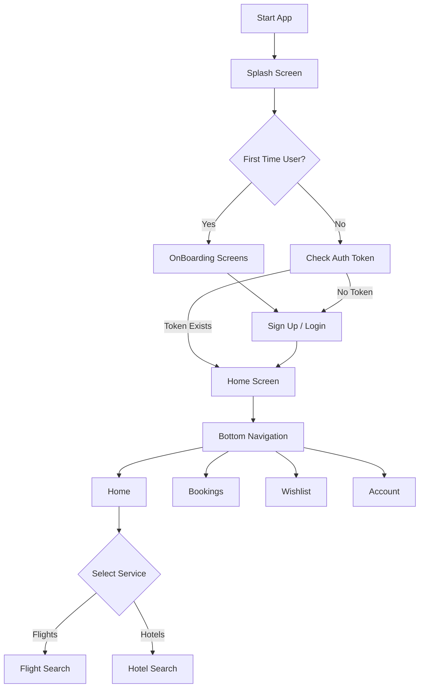

## 2. Authentication Flow

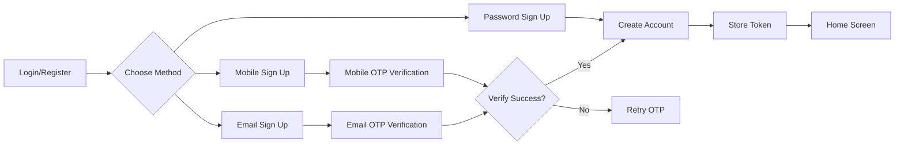

## 3. Flight Booking Flow

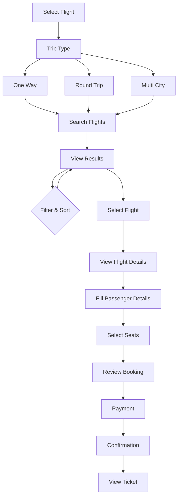

## 4. Hotel Booking Flow

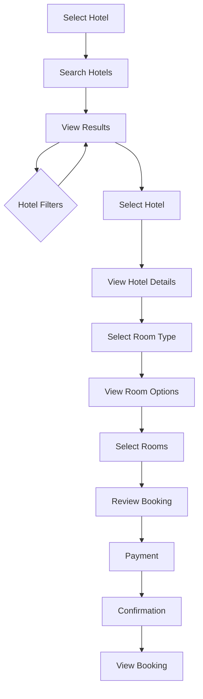

## 5. Navigation Structure

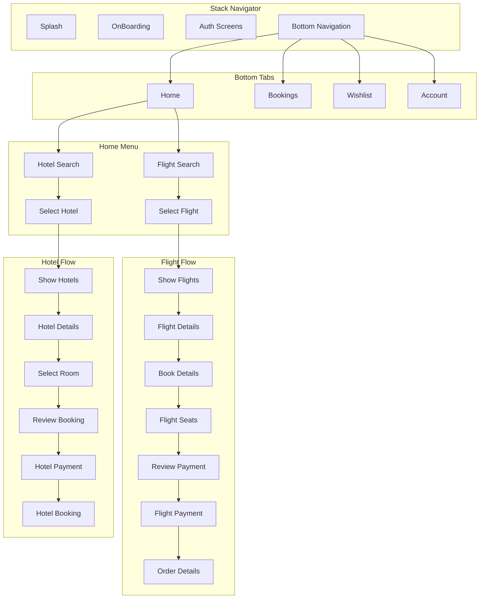

## 6. Data Flow Diagram (DFD) - Level 0

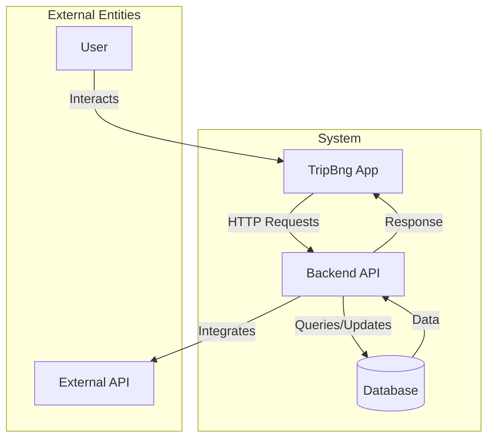

## 7. Data Flow Diagram (DFD) - Level 1

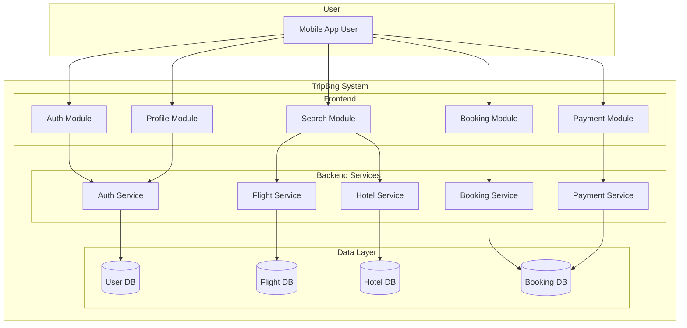

## 8. Use Case Diagram

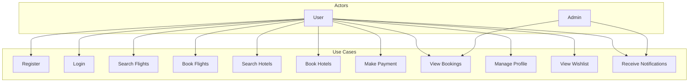

## 9. Database Schema Overview

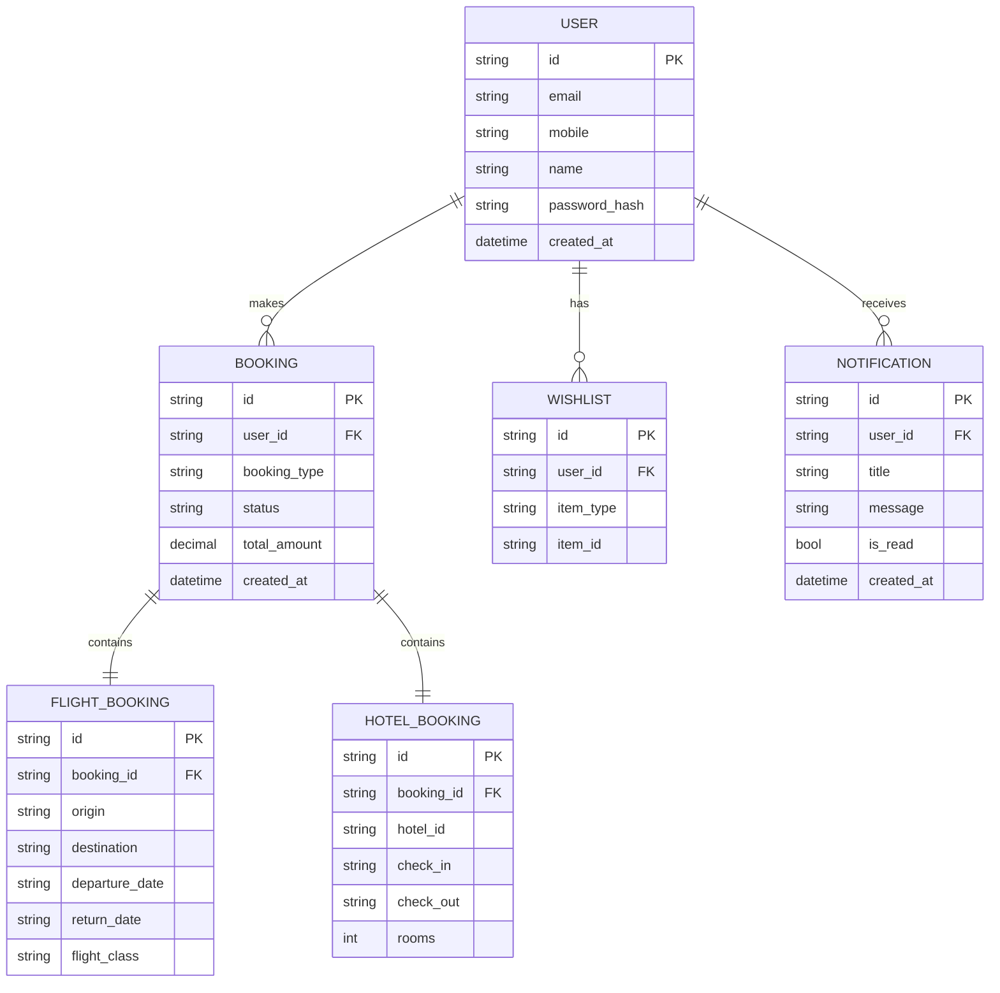

## 10. API Architecture

```mermaid
graph LR
    subgraph Client
        APP[TripBng App]
    end

    subgraph API_Gateway
        REQ[Request]
        MID[Middleware]
        AUTH[Auth Check]
    end

    subgraph Routes
        R1[/auth/*]
        R2[/flights/*]
        R3[/hotels/*]
        R4[/bookings/*]
        R5[/user/*]
    end

    subgraph Services
        S1[Auth Service]
        S2[Flight Service]
        S3[Hotel Service]
        S4[Booking Service]
    end

    APP --> REQ
    REQ --> MID
    MID --> AUTH
    AUTH --> R1
    AUTH --> R2
    AUTH --> R3
    AUTH --> R4
    AUTH --> R5

    R1 --> S1
    R2 --> S2
    R3 --> S3
    R4 --> S4
```

## 11. State Management Overview

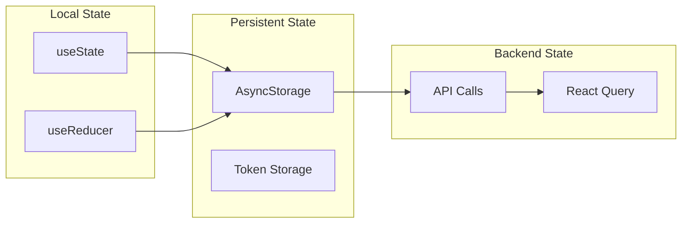

## 12. Component Hierarchy

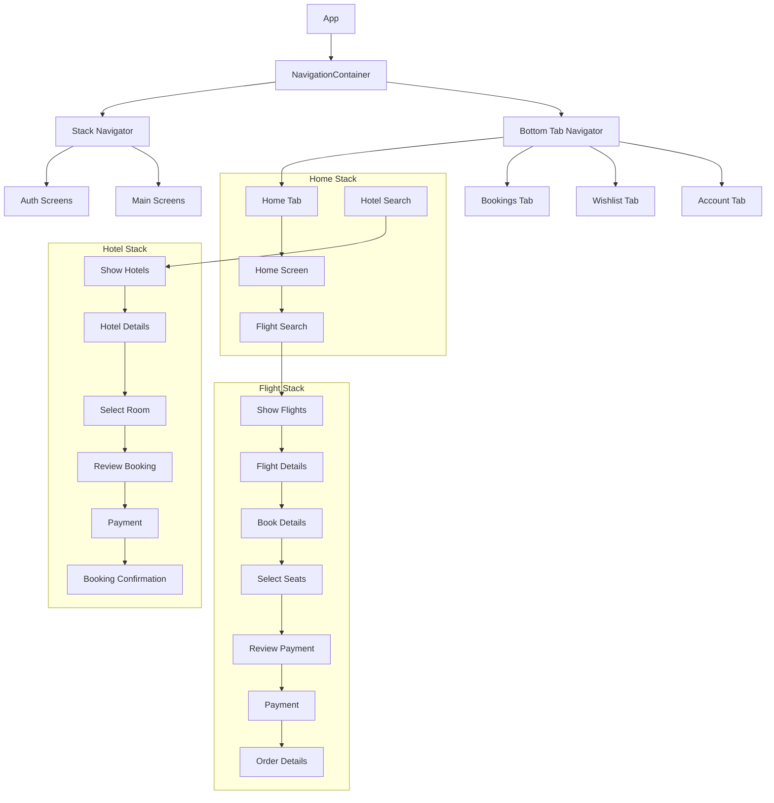
